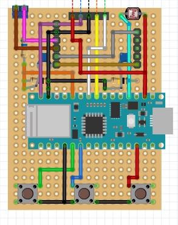

# yet another useless clock

Because I inherited a bit of an obsession for clocks from my grandpa. Here I'm building another clock using an Arduino.
Compare to the repository [Opa-Uhr-neu](https://github.com/theholypumpkin/Opa-Uhr-Neu.git) This clock can do less, only showing minutes and hours as well as the day, month or  the battery precentage by press of a button.
This is acctually the second clock I build using this code. The first one got lost during moving. 

One big difference to Opa-Uhr-Neu is the use of the Arduino Nano 33 IoT instead of an classic Nano, Nano-Every. I have still so many of those I want to get rid of.
With the Nano 33 IoT I can fetch the current time from the Internet. As the Internal RTC of the RTC Nano is so unprecise I't could be a software clock using `millis()` I fetch the time once an hour.

Here is the PCB-Layout If someone want to recraete it

Anyway have fun, keeping your time or something :).
